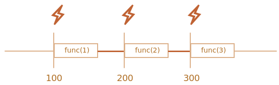
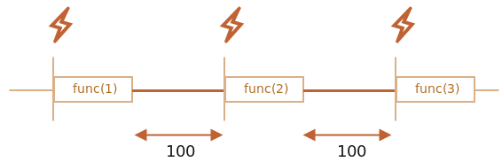

# JavaScript Lovers

---

## Table of Contents

1. [Why for..in method is not best solution to iterate array?](#forin_drawback)
2. [Why for..in method is slower than other methods?](#forin_slower)
3. [Associative array in JavaScript](#associative_array)
4. [Why [] == [] returns false?](#array_comparison)
5. [Explain about setTimeout with best example.](#setTimeout_explain)
6. [Difference between `null` and `undefined`](#diff_null_and_undefined)
7. [Difference between `REST` and `SPREAD` operators](#difference_rest_and_spread)
8. [Difference between `setTimeout` and `setInterval`.](#difference_setTimeout_and_setInterval)
9. [Difference between Pure and Impure function](#difference_pure_and_impure)

### Why for..in method is not best solution to iterate array?<a name="forin_drawback"></a>

---

```javascript
Array.prototype.testingVariable = 1;
Array.prototype.testingMethod = function () {
  console.log("testing method");
};

let arrayTestToResizeArray = [10, 20];

//Resize the array
arrayTestToResizeArray[5] = "Javascript Lovers";

//Array iterate using for loop
console.log(`index: value`);
for (let index = 0; index < arrayTestToResizeArray.length; index++) {
  // Iterate over numeric indexes from 0 to 5, as everyone expects.
  console.log(`${index}: ${arrayTestToResizeArray[index]}`);
}
/* Will display output like:
    index: value
    0 : 10
    1 : 20
    2 : undefined
    3 : undefined
    4 : undefined
    5 : Javascript Lovers
*/

//Similarly, array iterate using for..in method
console.log(`index: value`);
for (let index in arrayTestToResizeArray) {
  // Iterate over numeric indexes from 0 to 5, as everyone expects.
  console.log(`${index}: ${arrayTestToResizeArray[index]}`);
}
/* Will display output like:
    index: value
    0 : 10
    1 : 20
    5 : Javascript Lovers
    testingVariable: 1
    testingMethod: function() {
        console.log("testing method");
    }
*/
```

### Explanation about for_in and for loop difference:

---

- `for loop` counts from 0 to 6, and also ignores `Array.prototype.testingVariable` and `Array.prototype.testingMethod`. It shows array values.

- `for...in` lists only the `10, 20 and Javascript Lovers`, ignoring undefined array indexes, but adding `Array.prototype.testingVariable` and `Array.prototype.testingMethod`. It shows array property names.

### Note:

While using `for...in` loop we have to use `hasOwnProperty()` to check current object property.

### Conclusion:

All `objects` in JS are `associative`. A `JS Array` is an `object`, so yes, it’s `associative too`. If you want to iterate over an object's keys, use `for (var key in object)`. Hence, `For...in` loop is find the `elements` from the array as well as `property` from prototype because parent class is an object.

## Why for_in loop is slower than other methods?<a name="forin_slower"></a>

---

For..in method is slower because it `iterates an associative array or object properties`. In other words, in js everything is object. Even `array is also object` in js which inherits prototype of object. Hence, it will check all property of the object as well. Therefore, for..in loop is slower than other loops.

## Associative array in JavaScript<a name="associative_array"></a>

---

- Associative arrays are `basically objects` in JavaScript where `indexes` are replaced by `user-defined keys`. They do `not` have a `length property` like a normal array and cannot be traversed using a normal for loop.

### Syntax:

```javascript
let arr = { key1: "value1", key2: "value2" };
```

### Example:

```javascript
var arr = { "Company Name": ‘Javascript Lovers’, "ID": 123};
```

## Why [] == [] returns false?<a name="array_comparison"></a>

---

### Example:

```javascript
[] == []; // false
```

### Explanation:

- It returns false because all `objects` in JS are `associative`. A `JS Array` is an `object`, so yes, it’s `associative too`.

- [] creates a new array, so you are` comparing one array object with another array object`. It's `not the contents of the arrays` that is compared, the `object references are compared`. As a result, `they are not equal because it's not the same object instance.`

## Explain about setTimeout with best example.<a name="setTimeout_explain"></a>

---

### Example

```javascript
let x = true;
setTimeout(() => {
  x = false;
}, 0);
while (x) {
  console.log(`Hello`);
}
console.log(`End of the task execution`);
/* Will display output like:
    Hello for infinit times
*/
```

### Explanation

This code will iterate the loop for `infinite times` because for setTimeout it will `wait 0 seconds` to perform task execution. Meanwhile, call stack will `execute further loop` and it will `occupy the callstack` for infinite loop. Hence, it will `not execute setTimeout callback eventhough waiting is over` because callstack is occupied by while loop.

## Difference between `null` and `undefined`.<a name="diff_null_and_undefined"></a>

---

### Definition

`null` is an `assigned value`. It means nothing. `undefined` means a `variable has been declared` but `not defined yet`.

### Example

```javascript
var testVar;
alert(testVar); //shows undefined
alert(typeof testVar); //shows undefined
```

`null` is an `assignment value`. It can be assigned to a variable as a representation of no value:

```javascript
var testVar = null;
alert(testVar); //shows null
alert(typeof testVar); //shows object
```

From the preceding examples, it is clear that `undefined` and `null` are `two distinct types`: `undefined` is a type itself `(undefined)` while `null` is an `object.`

```javascript
null == undefined; // true
null === undefined; // false

typeof null; // object

typeof undefined; // undefined
```

## Difference between `REST` and `SPREAD` operators.<a name="difference_rest_and_spread"></a>

---

### Definition

JavaScript uses `three dots (...) for both the rest and spread operators`. But these `two operators` are `not the same`.

The `main difference` between rest and spread is that the `rest operator` puts `the rest of some specific user-supplied values into a JavaScript array`. But the `spread syntax expands iterables into individual elements`.

### Example

```javascript
function myBio(firstName, lastName, ...otherInfo) {
  return otherInfo;
}

// Invoke myBio function while passing five arguments to its parameters:
myBio("Javascript", "lovers", "Mayurkumar", "Malaviya", "Author");
```

In the snippet above, we used the `...otherInfo rest parameter` to put `"Mayurkumar", "Malaviya", and "Author" into an array.`

Now, consider this `example of a spread operator`:

```javascript
// Define a function with three parameters:
function myBio(firstName, lastName, company) {
  return `${firstName} ${lastName} runs by ${company}`;
}

// Use spread to expand an array’s items into individual arguments:
myBio(...["Javascript", "Lovers", "Mayurkumar"]);
```

In the snippet above, we used the `spread operator (...)` to spread `["Javascript", "Lovers", "Mayurkumar"]’s` content across `myBio()’s parameters.`

```javascript
const [a, b, ...{ pop, push }] = [1, 2];
console.log(a, b); // 1 2
console.log(pop, push); // [Function pop] [Function push]
```

In the snippet above, the rest property of `array destructuring assignment` can be another `array or object binding pattern`. This allows you to simultaneously `unpack the properties and indices of arrays`.

```javascript
const name = "Javascript lovers";
console.log([...name]); // ['J','a','v','a','s','c','r','i','p','t','','l','o','v','e','r','s';
```

In the snippet above, it will return and array with splited each characters.

```javascript
const myName = { firstName: "Javascript", lastName: "Lovers" };
const bio = { ...myName };

myName.firstName = "JS";

console.log(myName); // { firstName: "JS", lastName: "Lovers" }

console.log(bio); // { firstName: "Javascript", lastName: "Lovers" }
```

In the snippet above, myName’s update `did not reflect` in bio because we used the `spread operator on an object` that contains `primitive(old) values only`.

Note: A developer would call `myName a shallow object` because it contains only `primitive(old) items`.

`Here is one more example to understand rest operator with object reference:`

```javascript
const myName = {
  fullName: { firstName: "Javascript", lastName: "Lovers" },
};

const bio = { ...myName };

myName.fullName.firstName = "JS";

console.log(myName); // { fullName: { firstName: "JS", lastName: "Lovers" } }

console.log(bio); // { fullName: { firstName: "JS", lastName: "Lovers" } }
```

In the snippet above, myName’s update `is reflected` in bio because we used the spread operator on an object that contains a `non-primitive value.`

### `Note:`

- We call myName a `deep object` because it contains a non-primitive item.

- You do `shallow copy` when you create references while cloning one object into another. For instance, `...myName` produces a shallow copy of the `myName` object because whatever alteration you make in one will reflect in the other.

- You do `deep copy` when you clone objects without creating references. For instance, I could deep copy `myName` into `bio` by doing `const bio = JSON.parse(JSON.stringify(myName))`. By doing so, the computer will clone `myName` into `bio` without creating any reference.

## Difference between `setTimeout` and `setInterval`.<a name="difference_setTimeout_and_setInterval"></a>

---

### Definition

We may decide to `execute a function not right now`, but at a `certain time` later. That’s called `“scheduling a call”`.

There are `two methods` for it:

- `setTimeout` allows us to run a function `once` `after the interval of time.`
- `setInterval` allows us to run a function `repeatedly, starting after the interval of time`,` then repeating continuously at that interval.`

### `setTimeout :`

Syntax:
To set timer:

```javascript
let timerId = setTimeout(func|code, [delay], [arg1], [arg2], ...);
```

To Canceling with clearTimeout
A call to setTimeout `returns` a `timer identifier` `timerId` that we can use to `cancel the execution`.

```javascript
clearTimeout(timerId);
```

### `Example :`

```javascript
function sayHi(phrase, who) {
  alert(phrase + ", " + who);
}

setTimeout(sayHi, 1000, "Hello", "Javascript Lovers"); // Hello, Javascript Lovers
```

### `setInterval :`

The setInterval method has the `same syntax` as setTimeout:
Syntax:

```javascript
let timerId = setInterval(func|code, [delay], [arg1], [arg2], ...)
```

To stop further calls, we should call clearInterval.

```javascript
clearInterval(timerId);
```

`Note:` We can also use `nested setTimeout` to execute task at specific interval as `setInterval` execute.

`Nested setTimeout` allows to set the delay between the executions `more precisely` than `setInterval`.

`For setInterval the internal scheduler will run function after every 100ms:`



- The real delay between `func calls` for `setInterval` is `less than in the code!`

- `That’s normal`, because the time taken by `func's execution “consumes” a part of the interval.`

- It is possible that func's execution turns out to be `longer than we expected` and takes more than 100ms.

- In this case the `engine waits for func to complete`, then checks the scheduler and if the time is up, `runs it again immediately`.

- In the `edge case`, if the function `always executes longer than delay ms`, then the calls will `happen without a pause at all`.

And here is the picture for the `nested setTimeout:`



`The nested setTimeout guarantees the fixed delay (here 100ms).`
That’s because a `new call is planned at the end of the previous one`.

`reference: click here`(https://javascript.info/settimeout-setinterval#:~:text=setTimeout%20allows%20us%20to%20run,repeating%20continuously%20at%20that%20interval.)

## Difference between `Pure` and `Impure` function<a name="difference_pure_and_impure"></a>

---

### Pure Function:

- A Pure Function is a function (a block of code) that always `returns the same result if the same arguments are passed`. It does `not depend on any state or data change` during a program's execution. Rather, it only `depends on its input arguments`.

- To be `considered pure`, functions must fulfil the following criteria:

  - they must be `predictable`
    - `Identical inputs` will always `return` `identical outputs`, no matter how many times a pure function is called. In other words: we can run a pure function as many times as we like, and given the inputs remain constant, the function will always predictably produce the same output.
  - they must have `no side effects`

    - A side-effect is any operation your function performs that is `not related to computing the final output, including` but `not limited to`:
      - Modifying a global variable
      - Modifying an argument
      - Making HTTP requests
      - DOM manipulation
      - Reading/writing files
    - A pure function must `both` be `predictable` and `without side-effects`. If either of these `criteria is not met, we're dealing with an impure function.`

    - An `impure function` is kind of the `opposite` of a `pure one` - it doesn't predictably produce the same result given the same inputs when called multiple times, and may cause side-effects.

### Examples of Pure and Impure function:

```javascript
// PURE FUNCTION  👼
const pureAdd = (num1, num2) => {
  return num1 + num2;
};

//always returns same result given same inputs
pureAdd(5, 5); //10

pureAdd(5, 5); //10

//IMPURE FUNCTION 😈
let plsMutateMe = 0;
const impureAdd = (num) => {
  return (plsMutateMe += num);
};

//returns different result given same inputs
impureAdd(5); //5
impureAdd(5); //10

console.log(plsMutateMe);
```

In the `above example`, the `impure` version of the function both `changes a variable outside its scope`, and `results in different output`, despite being called with identical input. This `breaks both rules` of pure functions and as such, `it's pretty clear we're dealing with an impure function here.`

`But` let's have a look at an example of an impure function that is `not so easy to tell apart from its pure counterpart.`

```javascript
//IMPURE FUNCTION 😈
const impureAddToArray = (arr1, num) => {
  arr1.push(num);
  return arr1;
};

impureAddToArray([1, 2, 3], 4); //[1,2,3,4]
impureAddToArray([1, 2, 3], 4); //[1,2,3,4]
```

`In above example`, given the same inputs, the function above will `always return the same output`. `But` it also `has the side effect of modifying memory` in-place by pushing a value into the original input array and is therefore `still considered impure`. `Adding a value to an array` via a `pure function` instead can be `achieved using the spread operator`, which `makes a copy of the original array without mutating it.`

```JAVASCRIPT
//IMPURE FUNCTION 😈
const impureAddToArray = (arr1, num) => {
  //altering arr1 in-place by pushing 🏋️
  arr1.push(num);
  return arr1;
};

// PURE FUNCTION 👼
const pureAddToArray = (arr1, num) => {
  return [...arr1, num];
};
```

### Pure vs Impure JavaScript Methods

`Certain JS functions from the standard library` are `inherently impure.`

- Math.random()
- Date.now()
- arr.splice()
- arr.push()
- arr.sort()

`Conversely, the below JS methods are typically associated` with `pure functions.`

- arr.map()
- arr.filter()
- arr.reduce()
- arr.each()
- arr.every()
- arr.concat()
- arr.slice()
- Math.floor()
- str.toLowerCase()

### Difference between Pure and Impure function

| 👼 Pure Functions 👼                                                          | 😈 Impure Functions 😈                                                |
| ----------------------------------------------------------------------------- | --------------------------------------------------------------------- |
| `no side-effects`                                                             | may have `side-effects`                                               |
| returns `same result` if same args passed in no matter how many times it runs | may return `different result` if same args passed in on multiple runs |
| `always returns` something                                                    | `may` take effect `without returning` anything                        |
| is `easily testable`                                                          | `might be harder to test` due to side-effects                         |
| is super useful in certain contexts                                           | is also super useful in certain contexts                              |

### How should we use `javscript impure function` sort() as a `pure function`?

```javascript
let a = [3, 1, 2];
a.sort();
console.log(a); // [1,2,3]

//similarly
a = [3, 1, 2];
[...a].sort(); // [1,2,3]
console.log(a); // [3,1,2]
```
